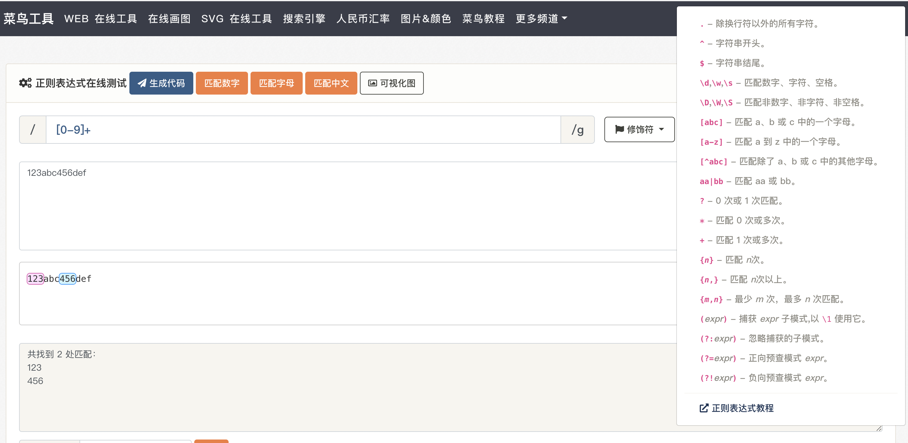
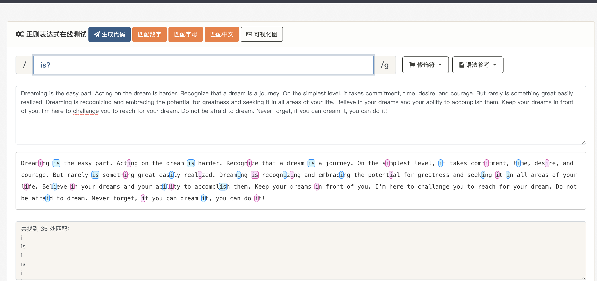
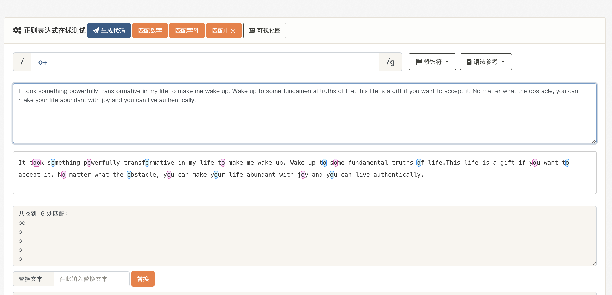
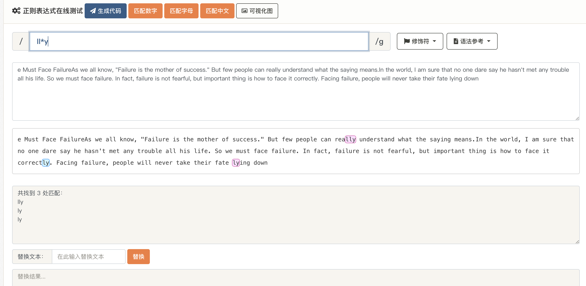
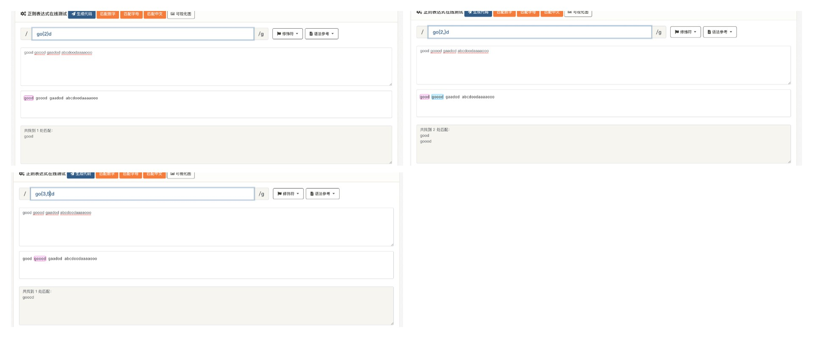
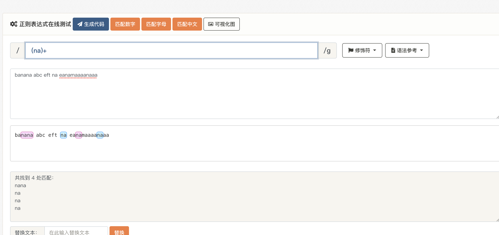
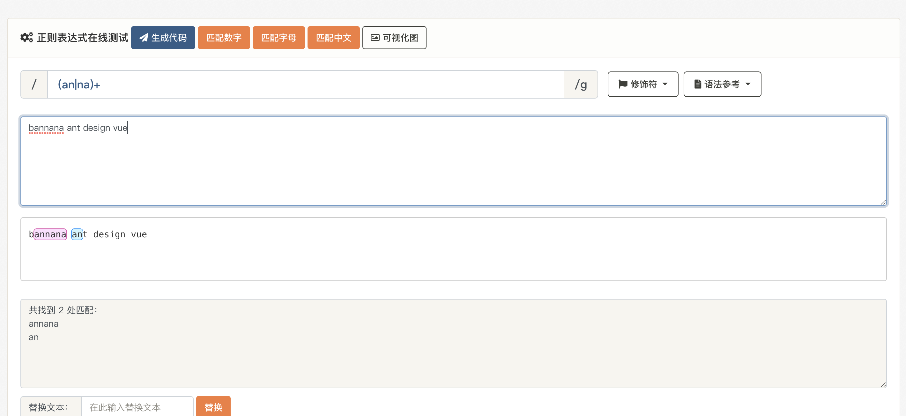
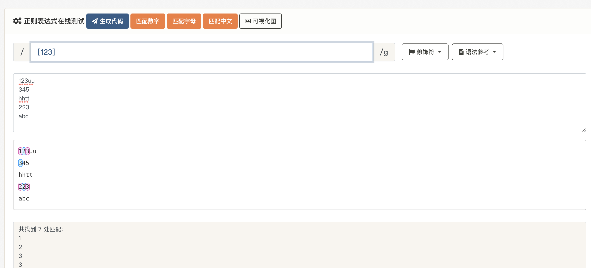
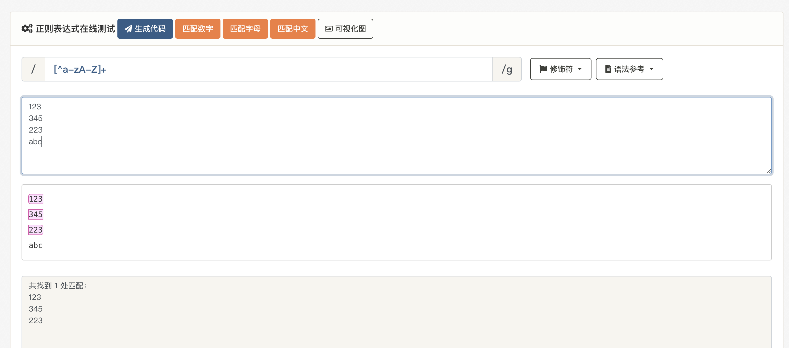

# 浅显易懂的正则表达式

[[toc]]
## 工具介绍
学习正则表达式少不了辅助型工具，推荐一个[在线正则表达式测试网站](https://c.runoob.com/front-end/854/), 也支持正则可视化。

## 基础

### 限定符(Quantifiers)

**?**

`?`表示前面的字符可以出现`1次`或者`0次`

 

**+**

`+`表示前面的字符至少匹配`1次`或`多次`
 

**`*`**

`*`可以匹配`0个`或者`多个字符`

 

**{...}**

`{...}`可以用来匹配固定数量的字符或某个范围内的字符

 

如上图所示：

+ `{2}`当只有一个参数时，只匹配固定数量。
+ `{2,3}`当有两个参数时，匹配范围内的。
+ `{2,}`当后面的参数为空时，匹配n个及以上。

**(...)**

以上都讲的是匹配单个字符，当我们想匹配多个字符该怎么办呢？

 

### 或运算符(OR Operator)

 

当我们需要匹配`两个`或`多个条件时`我们就需要使用`|`(或运算符)。图中我们匹配了拥有`an`或`na`的单词。值得注意的是这里的`｜`最外层的`()`是必不可少的。

### 字符类(Character class)

 

比如我们要匹配拥有`123`中任意字符的字符串则需要使用`[...]`,需要匹配的字符只能取自方括号中的内容。另外我们也可以使用字符类去匹配指定范围，如[a-z]、[0-9]、[\u4e00-\u9fa5]等。

 

另外我们也可以在前面加`^`用来匹配非此范围的字符串，如上我们就匹配了非英文的字符串。

## 高级概念

### 懒惰匹配和贪婪匹配(Lazy and Greed)
敬请期待

### 分组(Group)
敬请期待

### 非捕获分组(Non-capture Group)
敬请期待

### 回溯(Flash Back)
敬请期待

### 断言(Assertion)
敬请期待

### 反向先行断言
敬请期待

### 正向后行断言
敬请期待

### 反向后行断言
敬请期待

## 使用方式

### test()
敬请期待

### exec()
敬请期待

### match()
敬请期待

### replace()
敬请期待

### split()
敬请期待

